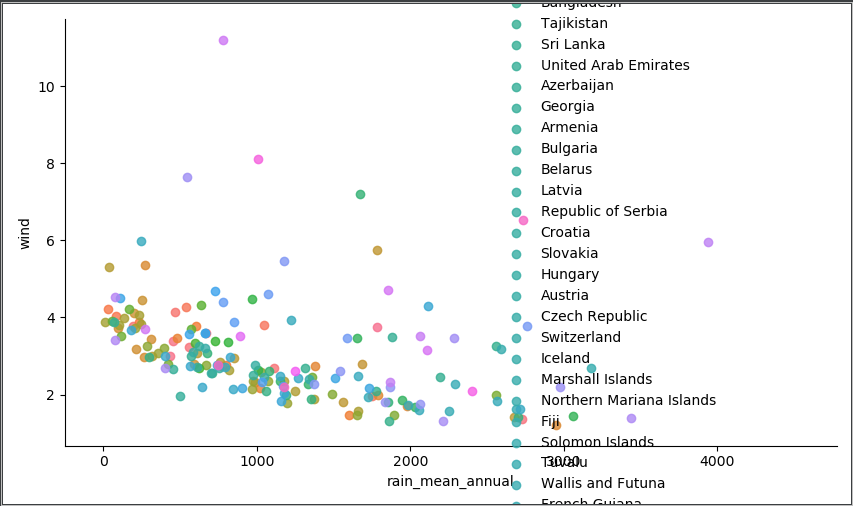
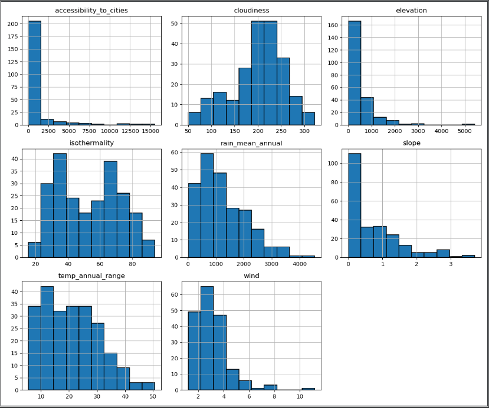
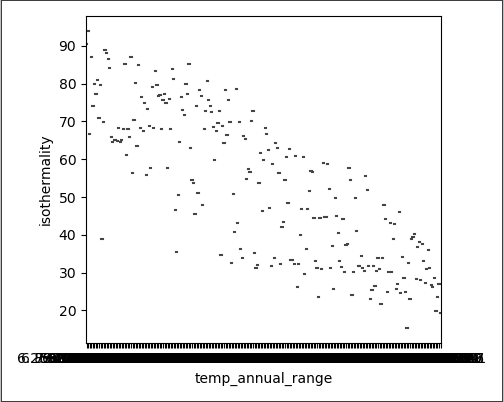
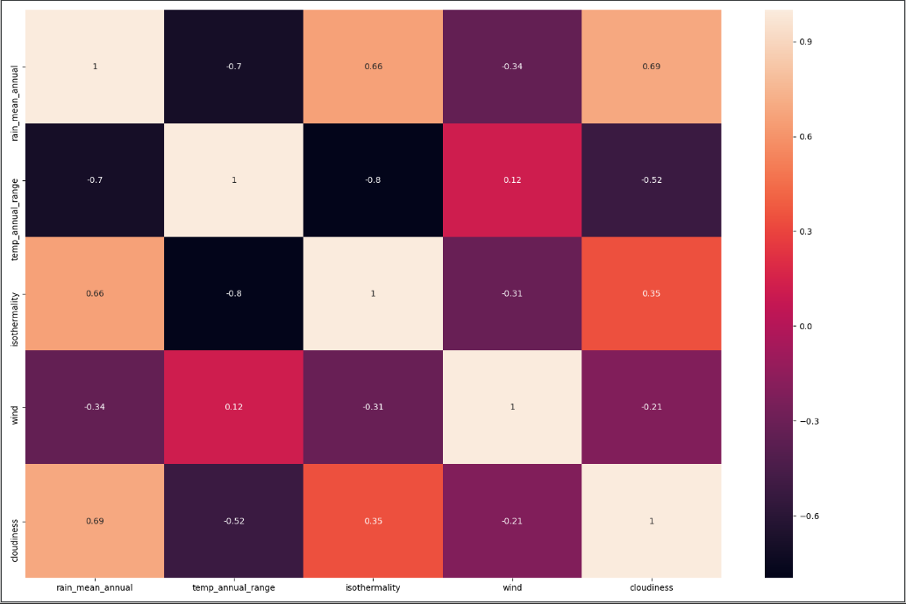
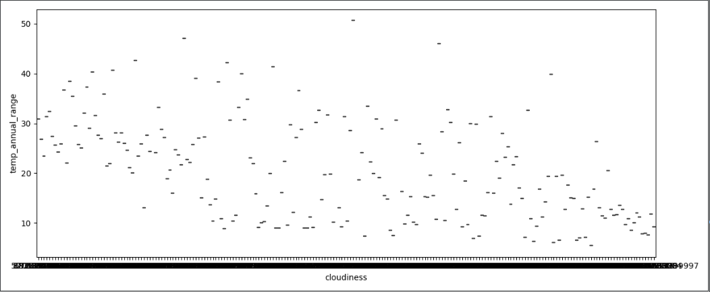
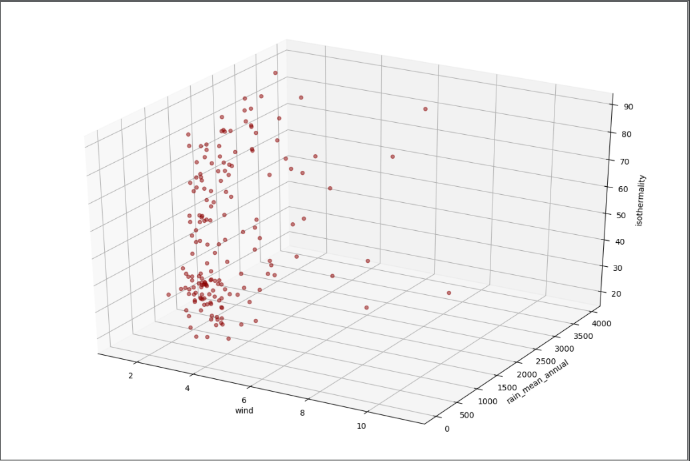
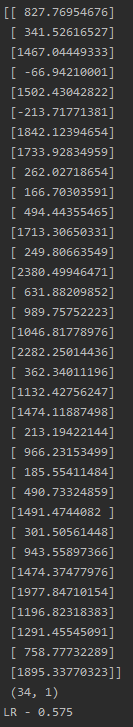
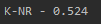
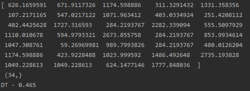
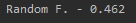

# 각 나라별 환경 예측하기

- 각 나라별 지형 또는 연 평균 날씨를 통해 환경을 예측해보기

## 과정

1. 각 나라별로 나라의 환경에 관한 데이터를 가져옵니다.
2. 데이터 분석합니다.
3. 학습시키고 예측합니다.

### lmplot



```python
evn.lmplot("rain_mean_annual", "wind","Country")
```

lmplot을 이용해 나라별로 연평균 강수량과 풍량을 그래프로 표현하였습니다.

### HISTOGRAM



```python
evn.myhist()
```

나라의 환경들을 히스토그램을 이용해 만들었습니다.

### VIOLINPLOT



```python
evn.myviolinplot("temp_annual_range", "isothermality")
```

등온성에 따른 바이올린플롯을 그려보았지만 데이터량과 잘 맞지 않아 아주 작은 바이올릿 플롯이 만들어졌습니다.

### HEATMAP



```python
evn.heatmap(["rain_mean_annual","temp_annual_range","isothermality","wind","cloudiness"])
```

히트맵을 통해 각 컬럼 별로 얼마나 관계가 깊은지 확인했습니다.

### BOXPLOT



```python
evn.boxplot("cloudiness", "temp_annual_range")
```

temp_annual_range에 따른 cloudiness 상태를 보았습니다. 박스플롯 역시 데이터량이 적절치 않아 아주 작은 그래프가 형성되었습니다.

### 3D PLOT



```python
evn.plot_3d("wind", "rain_mean_annual", "isothermality")
```

풍량, 연평균 강수량, 등온성의 데이터 분포를 3D로 시각화 했습니다.

### 학습 및 예측









```python
evn.run_all(["cloudiness","temp_annual_range"], ["rain_mean_annual"])
```

흐림과 연평균 기온을 통해 연평균 강수량을 예측하고자 Logistic Regression, K-Neighbor Regression, Decision Tree, Random Forest 순서대로 학습시키고 예측해보았습니다.